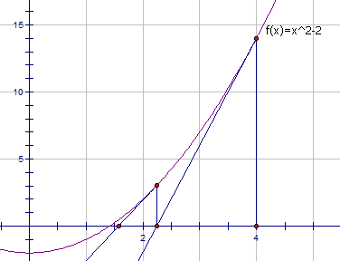

### [x 的平方根](https://leetcode-cn.com/problems/sqrtx/)(LeetCode_69_简单)

#### 1.题目

实现 int sqrt(int x) 函数。

计算并返回 x 的平方根，其中 x 是非负整数。

由于返回类型是整数，结果只保留整数的部分，小数部分将被舍去。

**示例 1:**

```
输入: 4
输出: 2
```

**示例 2:**

```
输入: 8
输出: 2
说明: 8 的平方根是 2.82842..., 
     由于返回类型是整数，小数部分将被舍去。
```

#### 2.分析

- 牛顿法

- 

  - 如果我们要求a的平方根，首先令f(x)=x^2-a;那么我们的目的就是求得x使得f(x)=0;

  - 由函数f(x)=x^2-a，我们求导可以知道，函数上任意一点(x,y)的切线的斜率为2x。

    假设过点（x0,y0）的切线方程为y=kx+b，那么切线与x轴的交点横坐标为-b/k。

    而b=y0-kx0,k=2x0,y0=x0^2-a,化简-b/k=（x0+a/x0）/2。

    也就是说（x0+a/x0）/2是过点（x0,y0）的切线与x轴的交点的横坐标。

    记（x0+a/x0）/2=x',继续求过点（x',f(x')）的切线与x轴的交点的横坐标x''，很明显x''比x'更靠近函数f(x)=x^2-a与x轴的交点的横坐标(即a的正平方根)。

    ​

#### 3.代码

牛顿法****

```python
    def mySqrt(self, x: int) -> int:
        # 牛顿法
        if x<=1 : return x
        
        r = x
        while r*r - x > 1*math.e**-9:
            r = (r+x/r)/2 
        return int(r)
```

**二分法**

```python
    def mySqrt(self, x):
        if x<=1 : return x
        
        # left,right 代表的含义可以有两种,1是搜索的下标位置,2是搜索的元素范围,此处表示搜索的元素范围,搜索[1,x)的数的平方是否是x
        left, right = 1, x
        while left<right:
            mid = (left+right)>>1
            sq = mid**2
            if sq == x:
                return mid
            # elif sq<x 还是sq>x决定了最后非法循环出去时,left=right=mid-1还是left=right=mid+1
            # 先写elif sq<x,举例【0,2】我们查询1,mid=(0+1)//2=0,nums[mid]<1,所以sq<x,所以left=mid+1=0+1,此时left<right不成立,退出循环,所以非法退出时,left
            # =right=mid+1
            elif sq<x:
                left = mid + 1
            elif sq>x:
                right = mid - 1
        # if left**2 > x:
        #     return left-1
        # else:
        #     return left
        # print(left,right)
        if right**2 > x:
            return right-1
        else:
            return right
```

