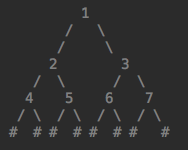

#### 1.题目

二叉树的序列化和反序列化



#### 2.代码

##### 序列化

```python
# 作者     ：gw
# 创建日期 ：2019-07-11  下午 19:31
# 文件名   ：二叉树序列化.py

class Node(object):
    """"""
    def __init__(self, data):
        self.data = data
        self.left = None
        self.right = None

class Bitree(object):
    def __init__(self,li):
        self.root = None
        if li:
            for i in li:
                self.add(i)

    def add(self, val):
        node = Node(val)
        if self.root is None:
            self.root = node
            return
        queue = [self.root]
        while queue:
            tmp = queue.pop(0)
            if tmp.left is None:
                tmp.left = node
                return
            else:
                queue.append(tmp.left)
            if tmp.right is None:
                tmp.right = node
                return
            else:
                queue.append(tmp.right)

    def breadth_travel(self, root):
        if root is None:
            return
        queue = [root]
        res = []
        while queue:
            tmp = queue.pop(0)
            res.append(tmp.data)
            if tmp.left is not None:
                queue.append(tmp.left)
            if tmp.right is not None:
                queue.append(tmp.right)
        return res

    def inorder(self, root):
        if root:
            self.inorder(root.left)
            print(root.data, end=" ")
            self.inorder(root.right)

    def serializer(self, root):
        if root is None:
            return ['#']
        left = self.serializer(root.left)
        right = self.serializer(root.right)
        return [root.data] + left + right

    def Serialize(self, root):
        if not root:
            return '#'
        return str(root.data) + ',' + self.Serialize(root.left) + ',' + self.Serialize(root.right)

	def deserializer(self, li):
        if not li:
            return None
        data = li.pop(0)
        root = None
        if data !='#':
            root = Node(data)
            root.left = self.deserializer(li)
            root.right = self.deserializer(li)
            
        return root
        


tree = Bitree([1,2,3,4,5])
# tree.inorder(tree.root)
ser = tree.serializer(tree.root)
print(ser)
ser1 = tree.Serialize(tree.root)
print(ser1)

root = tree.deserializer([1, 2, 4, '#', '#', 5, '#', '#', 3, '#', '#'])
print(tree.breadth_travel(root))
        
```

