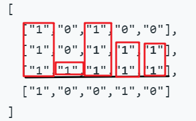

#### [最大矩形](https://leetcode-cn.com/problems/maximal-rectangle/)(LeetCode_85)

#### 1.题目

给定一个仅包含 0 和 1 的二维二进制矩阵，找出只包含 1 的最大矩形，并返回其面积。

**示例:**

```python
输入:
[
  ["1","0","1","0","0"],
  ["1","0","1","1","1"],
  ["1","1","1","1","1"],
  ["1","0","0","1","0"]
]
输出: 6
```

#### 2.分析

- 参考[柱状图中最大的矩形](https://leetcode-cn.com/problems/largest-rectangle-in-histogram/)(LeetCode_84)
- 
- 对每一行进行应用单调递减栈


- 动态规划 参考[接雨水](https://leetcode-cn.com/problems/trapping-rain-water/) 未写代码

- ```python
     用height_j记录第i行为底,第j列高度是多少.
     用left_j记录第i行为底, 第j列左边第一个小于height_j[j]的位置
     用right_j记录第i行为底, 第j列右边第一个小于height_j[j]的位置
     ```

     ​

#### 3.代码

**先计算出矩形高度矩阵**

```python
class Solution:
    def maximalRectangle(self, matrix: List[List[str]]) -> int:
        if not matrix or not matrix[0]: return 0
        res = 0
        arr = []
        n,m = len(matrix),len(matrix[0])
        for i in range(n):
            tmp_arr =[]
            for j in range(m):
                k = i
                tmp = 0
                while k>=0 and matrix[k][j]=="1":
                    k -= 1
                    tmp += 1
                tmp_arr.append(tmp)
            arr.append(tmp_arr)
        # for i in arr:
        #     print(i)
        # print(arr[2])
        import copy        
        res = 0
        for i in range(n):
            arr_ = [0]+copy.deepcopy(arr[i][:])+[0]
            # print(arr_)
            stack = []
            for j in range(m+2):
                if not stack or arr_[j]>arr_[stack[-1]]:
                    stack.append(j)
                else:
                    while stack and arr_[j]<=arr_[stack[-1]]:
                        tmp = stack.pop()
                        if stack:
                            res = max(res,(j-stack[-1]-1)*arr_[tmp])
                        else:
                            pass
                    stack.append(j)
        return res    
```


矩形高度矩阵，然后对每一行应用单调栈

```python
上面代码的17，18行的输出
for i in arr:
    print(i)

[1, 0, 1, 0, 0]
[2, 0, 2, 1, 1]
[3, 1, 3, 2, 2]
[4, 0, 0, 3, 0]
```


**计算一行矩形的高度就用一次单调栈**

```python
class Solution:
    def maximalRectangle(self, matrix: List[List[str]]) -> int:
        if not matrix or not matrix[0]: return 0
        res = 0
        arr = []
        n,m = len(matrix),len(matrix[0])
        for i in range(n):
            tmp_arr =[]
            for j in range(m):
                k = i
                tmp = 0
                while k>=0 and matrix[k][j]=="1":
                    k -= 1
                    tmp += 1
                tmp_arr.append(tmp)
            arr_ = [0]+tmp_arr[:]+[0]
            # print(arr_)
            stack = []
            for j in range(m+2):
                if not stack or arr_[j]>arr_[stack[-1]]:
                    stack.append(j)
                else:
                    while stack and arr_[j]<=arr_[stack[-1]]:
                        tmp = stack.pop()
                        if stack:
                            res = max(res,(j-stack[-1]-1)*arr_[tmp])                   
                        else:
                            pass
                    stack.append(j)
            # print(res)
        return res
```


**计算完一行中一个元素，就应用单调栈**

```python
class Solution:
    def maximalRectangle(self, matrix: List[List[str]]) -> int:
        if not matrix or not matrix[0]: return 0
        res = 0
        arr = []
        n,m = len(matrix),len(matrix[0])
        for i in range(n):
            heights =[0]*(m+2)
            stack = []
            for j in range(m+2):
                k = i
                tmp = 0
                
                while 1<=j<=m and k>=0 and matrix[k][j-1]=="1":
                    k -= 1
                    tmp += 1
                heights[j] = tmp
                while stack and heights[j]<heights[stack[-1]]:
                    t = stack.pop()
                    res = max(res, (j-stack[-1]-1)*heights[t])
                stack.append(j)
        return res 
```


**最优方法**

```python
class Solution:
    def maximalRectangle(self, matrix: List[List[str]]) -> int:
        if not matrix or not matrix[0]: return 0
        n,m = len(matrix),len(matrix[0])
        heights = [0]*(m+2)
        res = 0
        for i in range(n):
            stack = []
            for j in range(m+2):
                # 本来是 0<=j<=m,现在左边添加一个0
                if 1<=j<=m:
                    if matrix[i][j-1] == '1':
                        heights[j] += 1
                    else:
                        heights[j] = 0
                # heights[0] 和 heights[m+1] 我们没有动，始终为0，为的就是让所有元素全部出栈
                # 这儿不用等heights全部计算完，才用单调栈，因为单调栈每次只用heights[j]，我们不用等全部计算完，就可以使用单调栈
                while stack and heights[j]<heights[stack[-1]]:
                    tmp = stack.pop()
                    res = max(res, (j-stack[-1]-1)*heights[tmp])
                stack.append(j)
        return res
```

