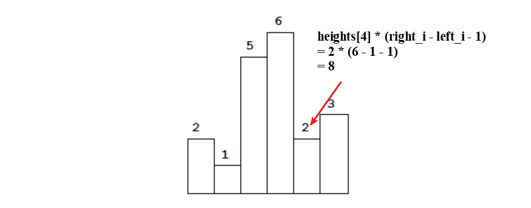
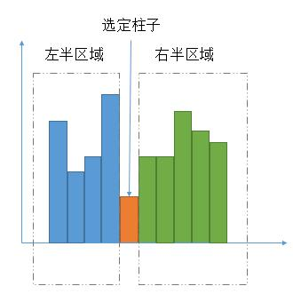

#### [柱状图中最大的矩形](https://leetcode-cn.com/problems/largest-rectangle-in-histogram/)(LeetCode_84)

#### 1.题目

给定 *n* 个非负整数，用来表示柱状图中各个柱子的高度。每个柱子彼此相邻，且宽度为 1 。

求在该柱状图中，能够勾勒出来的矩形的最大面积。


以上是柱状图的示例，其中每个柱子的宽度为 1，给定的高度为 `[2,1,5,6,2,3]`。


图中阴影部分为所能勾勒出的最大矩形面积，其面积为 `10` 个单位。

**示例:**

```
输入: [2,1,5,6,2,3]
输出: 10
```

#### 2.分析

**暴力法**

首先，要想找到第 i 位置最大面积是什么？

是以i 为中心，向左找第一个小于 heights[i] 的位置 left_i；向右找第一个小于于 heights[i] 的位置 right_i，即最大面积为 heights[i] * (right_i - left_i -1)，如下图所示：



所以，我们的问题就变成如何找 `right_i` 和 `left_i`？

最简单的思路就是，就是暴力法，直接分别在 `i` 左右移动。


**单调栈**

​	我们要求每一个矩形高度，左边和右边第一个小于该矩形高度的下标。

  - 首先明确，是小于，所以用单调递减栈。
  - 求左边，右边两边的下标，所以要在原始数组左右各添加一个无穷小（或者原始数组中的最小值）


**分治法**



1. 最大矩形区域在不包含选定柱子的左半区域当中。
2. 最大矩形区域在不包含选定柱子的右半区域当中。
3. 最大矩形区域包含选定柱子的区域。


#### 3.代码


**暴力法**

```python
class Solution(object):
    def largestRectangleArea(self, heights):
        n = len(heights)
        res = 0
        for i in range(n):
            width = 0
            h = heights[i]
            low = i-1
            while low>=0 and heights[low]>=h:
                low -= 1 
            high = i+1
            while high<n and heights[high]>=h:
                high += 1 
            width = high-low-1
            res = max(res,width * h)
        return res
```

**暴力法**

```python
class Solution:
    def largestRectangleArea(self, heights: List[int]) -> int:
        res = 0
        n = len(heights)
        for i in range(n):
            left_i = i
            right_i = i
            while left_i >= 0 and heights[left_i] >= heights[i]:
                left_i -= 1
            while right_i < n and heights[right_i] >= heights[i]:
                right_i += 1
            res = max(res, (right_i - left_i - 1) * heights[i])
        return res
```


**单调递减栈**

```python
class Solution:
    def largestRectangleArea(self, heights: List[int]) -> int:
        res = 0
        n = len(heights)
        stack = []
        # 单调递减栈，原始数组右边添加一个最小值，是为了让栈内元素全部出栈
        # 单调递增栈，原始数组右边添加一个最大值，是为了让栈内元素全部出栈
        heights = [0]+heights+[0]
        for i in range(len(heights)):
            if not stack or heights[i]>heights[stack[-1]]:
                stack.append(i)
            else:
                while stack and heights[stack[-1]]>=heights[i]:
                    # 每弹出一个元素，就计算比当前弹出元素小的元素有多少个
                    tmp = stack.pop()
                    if stack:
                    	res = max(res, (i-stack[-1]-1)*heights[tmp])
                    else:
                        # 高度为0的矩形，即heights[0]
                        pass
                stack.append(i)
        return res
        
```


**单调递减栈（简写）**

```python
class Solution:
    def largestRectangleArea(self, heights: List[int]) -> int:
        stack = []
        heights = [0] + heights + [0]
        res = 0
        for i in range(len(heights)):
            #print(stack)
            while stack and heights[stack[-1]] > heights[i]:
                tmp = stack.pop()
                res = max(res, (i - stack[-1] - 1) * heights[tmp])
            stack.append(i)
        return res
```


**分治法**

```python
class Solution:
    def largestRectangleArea(self, heights: List[int]) -> int:
        n = len(heights)
        if n == 1:
            return heights[0]*1
        if n == 0:
            return 0
        mid = n//2
        left = heights[:mid]
        right = heights[mid:]
        
        left_area = self.largestRectangleArea(left)
        right_area = self.largestRectangleArea(right)
        
        if left[-1]!=right[0]:
            if left[-1]>right[0]:
                h = left[-1]
                low = mid-1-1
                while low>=0 and left[low]>=h:
                    low -=1
                mid_area = (mid-low-1)*h
            
                h = right[0]
                high = mid+1
                low = mid-1-1
                while low>=0 and left[low]>=h:
                    low -=1
                high = mid+1
                while high<n and right[high-mid]>=h:
                    high +=1
                mid_area = max((high-low-1)*h,mid_area)
                
            else:
                h = right[0]
                high = mid+1
                while high<n and right[high-mid]>=h:
                    high +=1
                mid_area = (high-mid)*h
            
                h = left[-1]
                high = mid+1
                low = mid-1-1
                while low>=0 and left[low]>=h:
                    low -=1
                high = mid+1
                while high<n and right[high-mid]>=h:
                    high +=1
                mid_area = max((high-low-1)*h,mid_area)
        else:
            h = left[-1]
            low = mid-1-1
            while low>=0 and left[low]>=h:
                low -=1
            high = mid+1
            while high<n and right[high-mid]>=h:
                high +=1
            mid_area = (high-low-1)*h
                    
        return max(left_area,right_area,mid_area)
```

