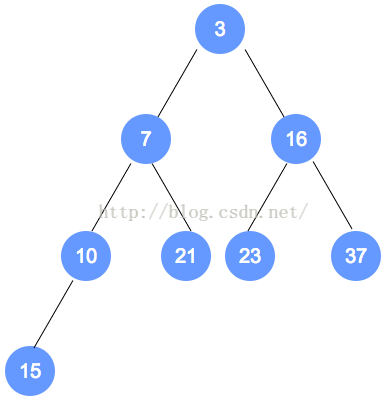
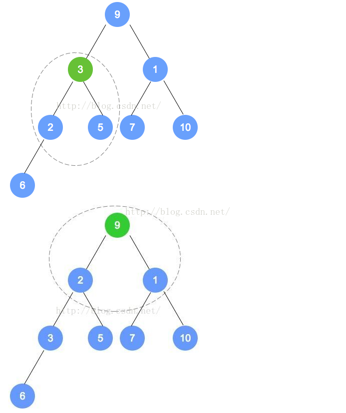
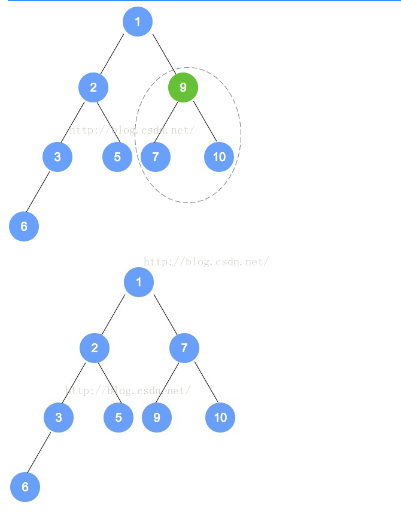
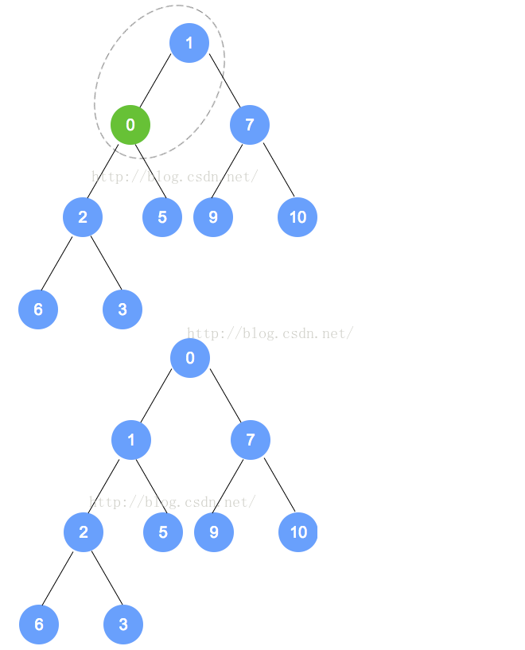
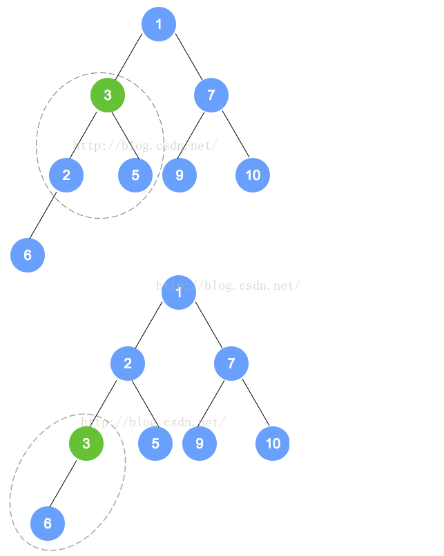
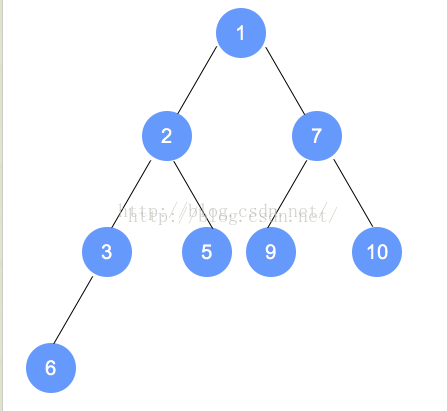

### 1.简介

​       最小堆是一棵完全二叉树，非叶子结点的值不大于左孩子和右孩子的值。本文以图解的方式，说明

最小堆的构建、插入、删除的过程。搞懂最小堆的相应知识后，最大堆与此类似。

2.最小堆示例

3.最小堆的构建

​      初始数组为：9,3,7,6,5,1,10,2

​      按照完全二叉树，将数字依次填入。

​      填入后，找到最后一个结点（本示例为数字2的节点），从它的父节点（本示例为数字6的节点）

开始调整。根据性质，小的数字往上移动；至此，第1次调整完成。

​      注意，被调整的节点，还有子节点的情况，需要递归进行调整。

​      第二次调整，是数字6的节点数组下标小1的节点（比数字6的下标小1的节点是数字7的节点），

用刚才的规则进行调整。以此类推，直到调整到根节点。

​      以下是本示例的图解：

注意：数字9的节点 将和 数字1的节点 发生对调，对调后，需要递归进行调整，请一定注意。

4.最小堆的元素插入

​       以上个最小堆为例，插入数字0。

​       数字0的节点首先加入到该二叉树最后的一个节点，依据最小堆的定义，自底向上，递归调整。

​       以下是插入操作的图解：

5.最小堆的节点删除

​       对于最小堆和最大堆而言，删除是针对于根节点而言。

​       对于删除操作，将二叉树的最后一个节点替换到根节点，然后自顶向下，递归调整。

​       以下是图解：

