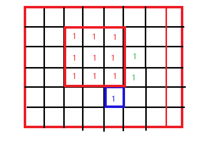

#### [最大正方形](https://leetcode-cn.com/problems/maximal-square/)(LeetCode 221)

#### 1.题目

在一个由 0 和 1 组成的二维矩阵内，找到只包含 1 的最大正方形，并返回其面积。

**示例:**

```
输入: 

1 0 1 0 0
1 0 1 1 1
1 1 1 1 1
1 0 0 1 0

输出: 4
```

#### 2.分析



```
dpi - 1，dpi 和 dpi - 1 都有可能转移到 dpi
```


```python
	在上图中，我们可以看到以 (i - 1，j - 1) 这个点为右下角的最大正方形的边长为2（红色），以 (i - 1，j) 这个点为右下角的最大正方形的边长为3（绿色），以 (i，j - 1) 这个点为右下角的正方形的边长为1（蓝色），那么以 (i，j) 为右下角的最大正方形的边长应该为多少呢？

	那么 (i - 1，j) 只能往上和往左延伸3个单位，(i，j - 1) 只能往上和往左延伸1单位，(i - 1，j - 1) 只能往上和往左延伸2个单位：

dpi = min(dpi，min(dpi - 1，dpi - 1，dpi) + 1)

```


- 可以参考[最大矩形](https://leetcode-cn.com/problems/maximal-rectangle/) ，单调栈

#### 3.代码

##### C++代码

```c++
class Solution {
public:
    int maximalSquare(vector<vector<char>>& matrix) {
        if (matrix.empty() || matrix[0].empty()) return 0;
        int m = matrix.size(),n = matrix[0].size(),res = 0;
        vector<vector<int>> dp(m,vector<int>(n,0));
        for(int i =0;i<m;++i) if (matrix[i][0]=='1'){
            dp[i][0] = 1;res=1;
        }
        for(int j =0;j<n;++j) if (matrix[0][j]=='1'){
            dp[0][j] = 1;res=1;
        }
        for(int i=1;i<m;i++)
            for(int j=1;j<n;j++)
            {
                if (matrix[i][j] == '1'){
                    dp[i][j]=min(dp[i][j-1],min(dp[i-1][j],dp[i-1][j-1]))+1;
                    res = max(res,dp[i][j]);
                }
            }
        return res*res;
        
    }
};
```

##### python

```python
class Solution:
    def maximalSquare(self, matrix: List[List[str]]) -> int:
        if len(matrix)==0 or len(matrix[0]) == 0:return 0
        m,n = len(matrix),len(matrix[0])
        dp = [[0]*n for i in range(m)]
        res = 0
        for i in range(m):
            if matrix[i][0] == '1':
                dp[i][0] = 1
                res = 1
        for j in range(n):
            if matrix[0][j] == '1':
                dp[0][j] = 1
                res = 1
        # 从1行1列开始遍历
        for i in range(1,m):
            for j in range(1,n):
                if matrix[i][j]=='1':
                    dp[i][j] = min(dp[i-1][j-1],dp[i][j-1],dp[i-1][j])+1
                    print(dp[i][j])
                    res = max(res,dp[i][j])
        return res*res
```

##### python，在里面赋dp的初值

```python
    def maximalSquare(self, matrix: List[List[str]]) -> int:
        if len(matrix)==0 or len(matrix[0]) == 0:return 0
        m,n = len(matrix),len(matrix[0])
        dp = [[0]*n for i in range(m)]
        res = 0
        # 从0行0列开始遍历
        for i in range(m):
            for j in range(n):
                if matrix[i][j]=='1':
                    dp[i][j] = min(dp[i-1][j-1],dp[i][j-1],dp[i-1][j])+1
                    res = max(res,dp[i][j])
                else:
                    dp[i][j]=0
        return res*res
```

