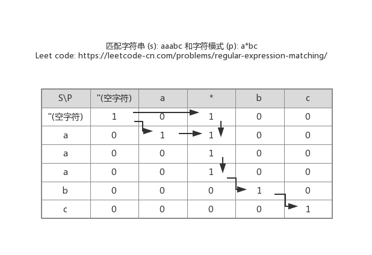

#### [正则表达式匹配](https://leetcode-cn.com/problems/regular-expression-matching/)(LeetCode_10)

#### 1.题目

给你一个字符串 `s` 和一个字符规律 `p`，请你来实现一个支持 `'.'` 和 `'*'` 的正则表达式匹配。

```
'.' 匹配任意单个字符
'*' 匹配零个或多个前面的那一个元素
```

所谓匹配，是要涵盖 **整个** 字符串 `s`的，而不是部分字符串。

**说明:**

- `s` 可能为空，且只包含从 `a-z` 的小写字母。
- `p` 可能为空，且只包含从 `a-z` 的小写字母，以及字符 `.` 和 `*`。

**示例 1:**

```
输入:
s = "aa"
p = "a"
输出: false
解释: "a" 无法匹配 "aa" 整个字符串。
```

**示例 2:**

```
输入:
s = "aa"
p = "a*"
输出: true
解释: 因为 '*' 代表可以匹配零个或多个前面的那一个元素, 在这里前面的元素就是 'a'。因此，字符串 "aa" 可被视为 'a' 重复了一次。
```

**示例 3:**

```
输入:
s = "ab"
p = ".*"
输出: true
解释: ".*" 表示可匹配零个或多个（'*'）任意字符（'.'）。
```

**示例 4:**

```
输入:
s = "aab"
p = "c*a*b"
输出: true
解释: 因为 '*' 表示零个或多个，这里 'c' 为 0 个, 'a' 被重复一次。因此可以匹配字符串 "aab"。
```

**示例 5:**

```
输入:
s = "mississippi"
p = "mis*is*p*."
输出: false
```

#### 2.分析



        思路: 动态规划, 沿着匹配串和字符串构成矩阵的对角线传递状态
        1. 状态矩阵的首行与首列对应于空字符与空匹配符
        2. 对角线意味着匹配串是否匹配对应的字符串


#### 3.代码

字符串：s串

匹配串：p串

```python
def isMatch(self, s: str, p: str) -> bool:
    s_len = len(s)
    p_len = len(p)
    
    dp = [[False] *(p_len+1) for _ in range(s_len+1)]
    # 初始化
    # 两串都为空时，算匹配成功
    dp[0][0] = True
    # 匹配串为空串时，字符串1个以上字符时，匹配不成功，即第一列从第一个字符开始为False，由于创建dp
    # 时候，已经设置好了，所以这儿不用再次初始化
    
    # 当字符串是空串时，匹配串不为空，根据规则, *前必存在一个字符, 则当前为*时, 其状态与前2的状态一致
	for i in range(0,p_len):
        # *出现的位置只能是大于等于1（从0开始计数）
        # dp和字符串实际位置相差1，所以当前状态p[i]的上上（前2）状态位dp【i-2+1】，都要在dp位置上加1
        if p[i] == '*' and dp[0][i-1]:
            dp[0][i+1] = True
    for i in range(1,s_len+1):
        for j in range(1,p_len+1):
            if p[j-1] == '.' or s[i-1] == p[j-1]:
                dp[i][j] = dp[i-1][j-1]
            elif p[j-1] == '*':
                # 根据匹配规则，比较匹配串*的前一个字符 与 字符串的当前字符
                # 二者不相等时，a* 只有作为空串，才能匹配成功
                # 也就是，匹配串需要看前两个字符的状态
                if p[j-2] != s[i-1]:
                    dp[i][j] = dp[i][j-2]
             	# 两者相等时，a* 可以作为空字符，单字符a，多字符处理  aaa
                if p[j-2] == s[i-1] or p[j-2] =='.':
                    dp[i][j] = dp[i][j-2] or dp[i][j-1] or dp[i-1][j]
    return dp[-1][-1]
    
    
    
```


**回溯法**

```python
class Solution:
    def isMatch(self, s: str, p: str) -> bool:
        '''
            回溯算法: 从后往前匹配, 一旦遇到 *，前面必然有个字符
        '''
        def match(ins,inp):
            if inp==-1:
                if ins==-1:
                    return True
                return False
            if p[inp] == '*':
                # * 匹配多个字符（>=1个字符）
                if ins>-1 and (p[inp-1] == s[ins] or p[inp-1]=='.'):
                    if match(ins-1,inp):
                        return True
                # * 匹配0个字符
                return match(ins,inp-2)
            if ins >-1 and(p[inp]==s[ins] or p[inp]=='.'):
                return match(ins-1,inp-1)
            return False
        return match(len(s)-1,len(p)-1)
        
    
```

