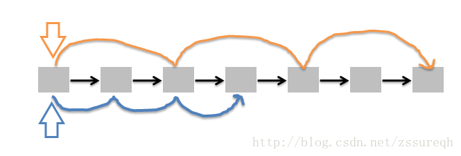

#### [环形链表](https://leetcode-cn.com/problems/linked-list-cycle/)(LeetCode 141)

#### 1.题目

给定一个链表，判断链表中是否有环。

为了表示给定链表中的环，我们使用整数 `pos` 来表示链表尾连接到链表中的位置（索引从 0 开始）。 如果 `pos` 是 `-1`，则在该链表中没有环。

 

**示例 1：**

```
输入：head = [3,2,0,-4], pos = 1
输出：true
解释：链表中有一个环，其尾部连接到第二个节点。
```


**示例 2：**

```
输入：head = [1,2], pos = 0
输出：true
解释：链表中有一个环，其尾部连接到第一个节点。
```


**示例 3：**

```
输入：head = [1], pos = -1
输出：false
解释：链表中没有环。
```


 

**进阶：**

你能用 *O(1)*（即，常量）内存解决此问题吗？

#### 2.分析



快慢指针

- ```python
      解法3：不使用额外空间，设置两个指针p1,p2，开始均指向头结点，然后每次p1向后移动一个节点，p2向后移动两个节点。然后比较两个指针指向的节点是否相同。如果相同，则判断出链表有环，如果不同，则继续下一次循环。有“环”自会“重逢”。
      此方法也可以用一个更生动的例子来形容：在一个环形跑道上，两个运动员在同一地点起跑，一个运动员速度快，一个运动员速度慢。当两人跑了一段时间，速度快的运动员必然会从速度慢的运动员身后再次追上并超过，原因很简单，因为跑道是环形的。
  ```

#### 3.代码

```python
        if not head or not head.next:return False
        
        fast = slow = head
        while fast and fast.next:
            fast = fast.next.next
            slow = slow.next
            if slow == fast:
                return True
        return False
```


 **置空法**

```python
    def hasCycle(self, head):
        if not head:
            return False
        while head.next and head.val != None:
            head.val = None  # 遍历的过程中将值置空
            head = head.next
        if not head.next:  # 如果碰到空发现已经结束，则无环
            return False
        return True  # 否则有环
```

